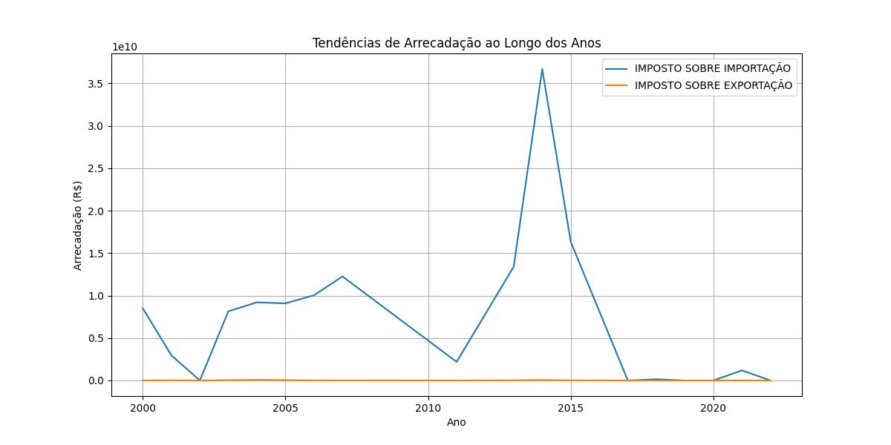
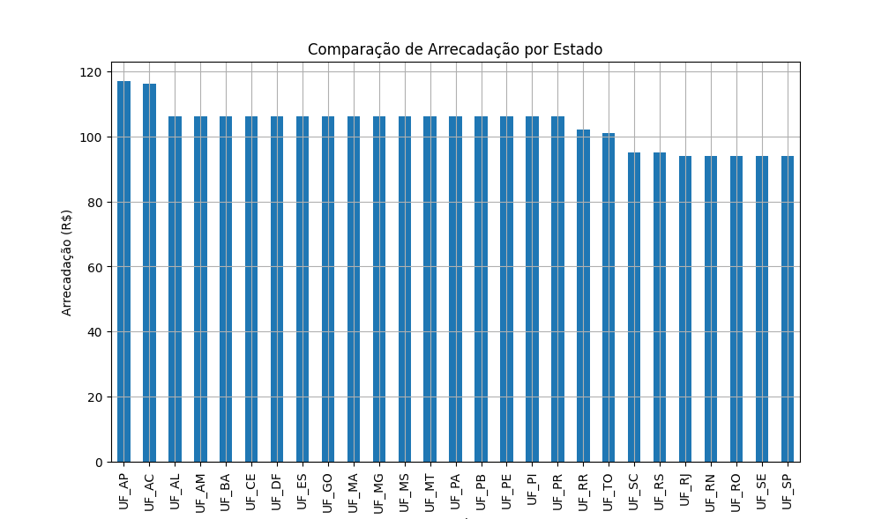
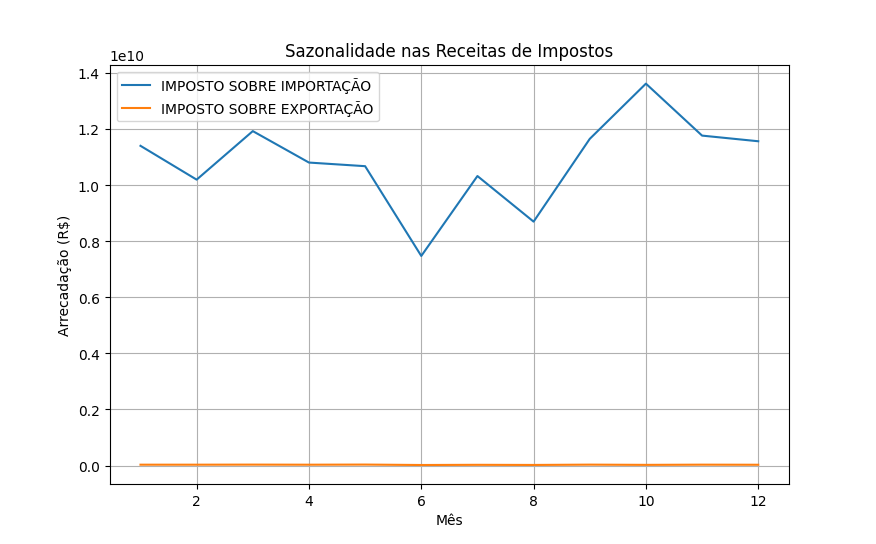
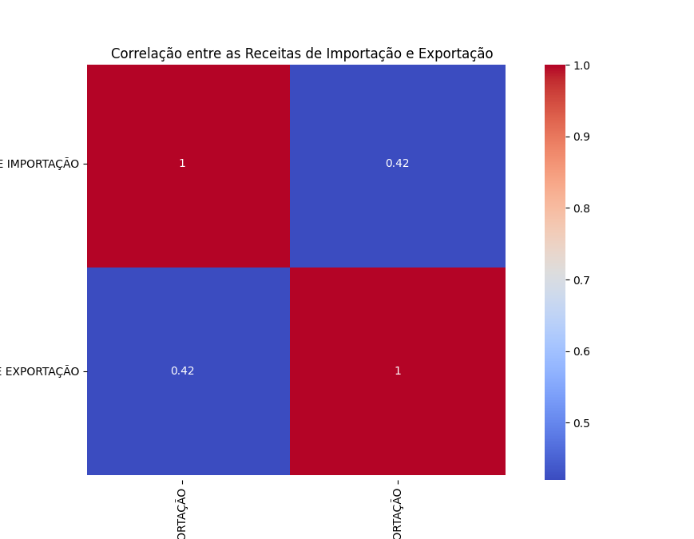
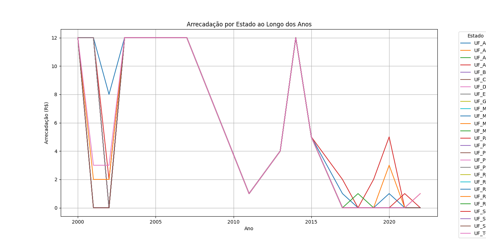
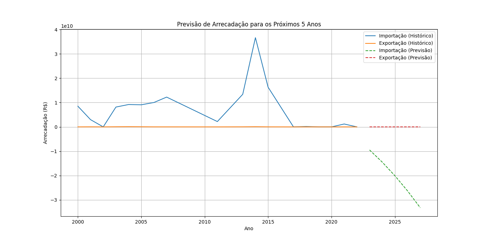

# 📊 Análise e Previsão de Arrecadação de Impostos 💰

Este projeto realiza uma análise dos dados de arrecadação de impostos sobre importação e exportação nos estados brasileiros ao longo dos anos, além de realizar previsões de arrecadação para os próximos 5 anos usando modelos de aprendizado de máquina. 🚀

## 🏗️ Estrutura do Código

O código realiza as seguintes etapas:

## 📈 Resultados e Visualizações

O código gera diversas visualizações importantes, armazenadas na pasta `assets/`:

1. **📅 Tendências de Arrecadação ao Longo dos Anos**  
     
   Mostra como a arrecadação dos impostos sobre importação e exportação se comportaram ao longo dos anos.

2. **🌎 Comparação de Arrecadação por Estado**  
     
   Compara a arrecadação por estado, destacando quais estados mais contribuíram.

3. **📉 Sazonalidade nas Receitas de Impostos**  
     
   Exibe a variação das receitas de impostos ao longo dos meses do ano.

4. **🔥 Correlação entre as Receitas de Importação e Exportação**  
     
   Mapa de calor para análise de correlação entre as receitas de importação e exportação.

5. **📊 Arrecadação por Estado ao Longo dos Anos**  
     
   Mostra como a arrecadação de impostos sobre importação e exportação evoluíram para cada estado ao longo dos anos.

6. **🔮 Previsão de Arrecadação para os Próximos 5 Anos**  
     
   Previsão das arrecadações de importação e exportação para os próximos cinco anos, com base no modelo de regressão polinomial.

## 📋 Requisitos

Certifique-se de ter as seguintes bibliotecas instaladas:

- `pandas` 🐼
- `numpy` 🔢
- `matplotlib` 📊
- `seaborn` 🎨
- `scikit-learn` 🤖

Você pode instalar as dependências necessárias utilizando o comando:

```bash
pip install pandas numpy matplotlib seaborn scikit-learn